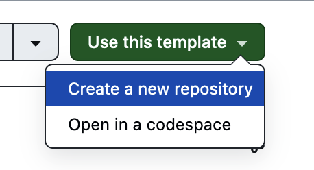

# djnf_sandbox

To get started, click the green "Use this template" button on the top right and choose "Create a new repository". Give it a cool name, like "djnf_sandbox". It'll appear among your repositories.

In _your_ repository, click on the other green "Code" button and choose the "Codespaces" tab, then "Create a codespace on main". It'll take a minute to do this. When it's done, you'll see three main areas: 

* on the left, the files in the repository
* to the right, this file in preview mode
* on the bottom, a terminal

In the terminal, type `bash install.sh` and hit return. Wait a minute while it finishes.

Then click on the file called `wget_example.md` to get started.

